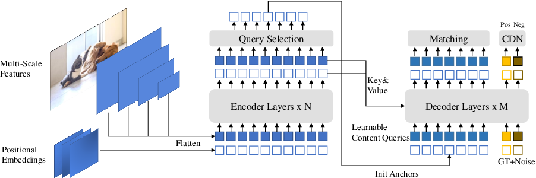

# Introduction
In this project, our primary objective is to conduct a comprehensive research study to determine the most suitable state-of-the-art pre-trained COCO model for the precise labeling of ground-based objects within an aerial object dataset. This research is crucial to enhance the accuracy and efficiency of our object detection process in an aerial and ground-based context.

The code originated from the official [DINO GitHub repository](https://github.com/IDEA-Research/DINO). However, we made modifications to the model during inference to align it with our primary objective. Additionally, we introduced a "results" folder containing multiple Python scripts specifically designed for retrieving and visualizing predictions in comparison to the ground-truth data. These functionalities are detailed in the "Results" section.

# Candidate models
Our primary resource this task was the ”paperwithcode” platform, specifically the object detection section [1], which offers an extensive array of potential neural networks. While numerous options were available, we prioritized those with the highest performance scores on the Common Objects in Context (COCO) dataset [2] and whose model weights were readily accessible in their respective GitHub repositories. The models that were selected for this analysis were:

* Deformable DETR: Deformable Detection Transformer (DETR) is an extension of the original DETR model that was introduced to address some limitations of traditional object detection methods. DETR, which stands for ”DEtection TRansformer,” leverages the power of transformers, originally designed for natural language processing tasks, for the task of object detection in images [3, 4].
  
* InternImage: InternImage was presented as a large-scale foundation model based on Convolutional Neural Network (CNN). Compared to the recent progress of large-scale Vision Transformer (ViT)s, large-scale models based on CNNs are still in an early state. The authors of this paper have developed InternImage to bridge this gap [5, 6].
  
* EVA: EVA is a research project that systematically explores the potential and scalability of masked visual representation learning for enhancing object detection accuracy. The primary aim is to assess the effectiveness of large-scale masked visual representation learning methods, particularly in scenarios featuring partially or fully occluded objects [7, 8].
  
* DINO: The DETR with Improved DeNoising Anchor Boxes (DINO) is an innovative research project that enhances end-to-end object detection by introducing a novel approach to model architecture and Contrastive DeNoising Training (CDT) [9, 10].

# Results
After selecting the pre-trained models (in COCO 2017 training set). We evaluated them against the COCO 2017 validation set. These evaluations provided us with important metrics, including the global performance indicators such as Average Precision (AP) and Average Recall (AR). Additionally, for certain models, we were able to delve deeper into the analysis by examining per-category results, which allowed us to assess the model's performance on individual object categories.

For a more comprehensive understanding of each model's performance and a detailed breakdown of the results, we recommend referring to the accompanying document [here](https://github.com/pascutc98/DINO_labeling_ground-based_objects/tree/main/results/Object-detection_networks_analysis_COCOval2017). Note that the best results for ground-based objects were obtained with the model DINO-4scale with SwinL as backbone.

# DINO model
The DETR (DEtection TRansformer) with Improved DeNoising Anchor Boxes (DINO) was the selected model. It is an innovative research project that enhances end-to-end object detection by introducing a novel approach to model architecture and Contrastive DeNoising Training (CDT) [9, 10]. The key features of this model are:

* Model architecture: The heart of the DINO approach lies in its adaptation of the DETR architecture, which has already shown remarkable promise in the field of object detection. DETR replaces the traditional anchor boxes and non-maximum suppression mechanisms found in CNN with a Transformer-based architecture. However, DINO takes DETR a step further by improving the way anchor boxes are used. In DINO, the model employs a novel mechanism for generating anchor boxes that are adapted to the specific characteristics of the dataset. Unlike conventional anchor boxes that are predefined and fixed, DINO’s anchor boxes are dynamically adjusted based on the features learned by the model. This adaptability allows the model to better align the anchor boxes with the objects in the image, leading to improved localization accuracy.

* One of the ground-breaking aspects of DINO is its use of CDT to enhance the robustness and generalization capabilities of the model. CDT is a self-supervised learning technique that leverages the power of contrastive learning to train the model.
In the context of DINO, CDT is applied during the pre-training phase. The model is presented with pairs of noisy images, where the noise can be in the form of various perturbations, occlusions, or distortions. The objective is to make the model learn to distinguish between anchor boxes and object features in the presence of these perturbations.This training forces the model to focus on the most discriminative features and helps it become more resilient to noise and clutter in real-world images.

* End-to-End Object Detection: DINO’s end-to-end object detection approach offers a seamless and unified framework for both localization and classification tasks. The model processes an entire image as a sequence of patches, leveraging the self-attention mechanism within the Transformer architecture to capture global and local context simultaneously. The dynamic anchor boxes, learned during training, are used to predict object locations.

By integrating the CDT into this end-to-end architecture, DINO achieves state-of-the-art results in object detection tasks. Its ability to adapt anchor boxes and robustly handle noisy inputs allows it to excel in scenarios where conventional object detectors might struggle.



# Installation
<details>
  <summary>Installation</summary>
  
  We use the environment same to DAB-DETR and DN-DETR to run DINO. If you have run DN-DETR or DAB-DETR, you can skip this step. 
  We test our models under ```python=3.7.3,pytorch=1.9.0,cuda=11.1```. Other versions might be available as well. Click the `Details` below for more details.
   1. Create conda environment
   ```sh
   conda create -n DINO python=3.7
   conda activate DINO
   ```

   2. Clone this repo
   ```sh
   git clone https://github.com/PascualWalaris/DINO_labeling_ground-based_objects.git
   cd DINO_labeling_ground-based_objects
   ```

   3. Install Pytorch and torchvision (it is crucial that you install pytorch with the same version of CUDA as you have downloaded)
   Check CUDA version:
   ```sh
   nvidia-smi
   ```

   Follow the instruction on https://pytorch.org/get-started/locally/. The below command is an example for a pytorch install for a system that has CUDA 11.8 installed.
   ```sh
   # an example:
   conda install pytorch torchvision torchaudio pytorch-cuda=11.8 -c pytorch -c nvidia
   ```

   4. Install other needed packages
   ```sh
   pip install -r requirements.txt
   ```

   5. Compiling CUDA operators
   ```sh
   cd models/dino/ops
   python setup.py build install
   # unit test (should see all checking is True)
   python test.py
   cd ../../..
   ```
</details>

# Data

<details>
  <summary>Data</summary>
If you want to get results for COCO dataset, please lease download [COCO 2017](https://cocodataset.org/) dataset and organize them as following:
  
```
COCODIR/
  ├── train2017/
  ├── val2017/
  └── annotations/
  	├── instances_train2017.json
  	└── instances_val2017.json
```

If you want to use your custom dataset, then you have to modify the function build() in [coco.py](https://github.com/pascutc98/DINO_labeling_ground-based_objects/blob/main/datasets/coco.py), and add the parameters _img_dataset_ and _ann_json_file_ which correspond to the image dataset and annotation .json file respectively.
  
</details>


# Run

<details>
  <summary>1. Eval our pretrianed models</summary>

  <!-- ### Evaluation of pre-trained model -->
  Download the corresponding checkpoint of DINO model from the official [DINO GitHub repository](https://github.com/IDEA-Research/DINO). In this project, we used the checkpoints with the highest epochs for each DINO model.
  ```sh
  bash scripts/DINO_eval.sh /path/to/your/COCODIR /path/to/your/checkpoint
  ```

</details>


<details>
  <summary>2. Inference and Visualization</summary>

For inference and visualization, we provide the folder [results](https://github.com/pascutc98/DINO_labeling_ground-based_objects/tree/main/results), here there is a brief summary:

* [Object-detection analysis for pre-trained neural networks](https://github.com/pascutc98/DINO_labeling_ground-based_objects/tree/main/results/Object-detection_networks_analysis_COCOval2017): This comprehensive document provides a detailed breakdown of the results achieved by each pre-trained model when applied to the COCO 2017 training set and evaluated against the COCO 2017 validation set. Within this document, you can explore the Average Precision (AP) and Average Recall (AR) scores for various model iterations, allowing for a thorough comparison of their performance. Furthermore, for select models, you'll find per-category results based on the COCO dataset, offering insights into the models' specific strengths and weaknesses across different object categories.

* [Data processing](https://github.com/pascutc98/DINO_labeling_ground-based_objects/tree/main/results/data_processing/code): Multiple Python scripts for multiple functionalities, for example: get a random sample from a bigger dataset of a .json file, make a statistical analysis of a .json file (number of images, number of annotations, per-category annotations analysis...), normalize the image ID of a .json file if its number is too high, clean the dataset from unwanted bounding boxes of a dataset, count the number of images with a certain resolution... Read the function description of each script for a more detailed information.

* [Inference and visualization](https://github.com/pascutc98/DINO_labeling_ground-based_objects/tree/main/results/inference_and_visualization): Within this folder, there are two primary scripts, each offering distinct functionalities. Please refer to the individual script descriptions for a more comprehensive understanding. The model used in each case is DINO-4scale-SwinL pre-trained in COCO 2017 training set:
  * _inference_and_add_categories_json_file.py_: This script empowers users to enhance a .json file in COCO format by adding annotations for specific user-selected categories. During this process, you have the option to visualize predictions as new annotations are incorporated into the file.
  * _inference_and_visualization.py_: This script serves a critical role in visualizing and saving results for negative images. It employs Intersection Over Union (IoU) to compare ground truth annotations with predictions. Users have the flexibility to set a threshold for displaying and saving negative examples based on their preferences.
 
</details>

# References
<details>
  <summary>References</summary>
    
  [1] Object Detection — Papers With Code - Object Detection. URL: https://paperswithcode.com/task/object-detection.
  
  [2] COCO - Common Objects in Context. URL: https://cocodataset.org/#overview.
  
  [3] Xizhou Zhu, Weijie Su, Lewei Lu, Bin Li, Xiaogang Wang, and Jifeng Dai. “Deformable DETR: Deformable Transformers for End-to-End Object Detection”. In: ICLR 2021 - 9th International Conference on Learning Representations (Oct. 2020). URL: https: //arxiv.org/abs/2010.04159v4
  
  [4] Xizhou Zhu, Weijie Su, Lewei Lu, Bin Li, Xiaogang Wang, and Jifeng Dai. GitHub - Deformable DETR: Deformable Transformers for End-to-End Object Detection. URL: https: //github.com/fundamentalvision/Deformable-DETR.
  
  [5] Wenhai Wang, Jifeng Dai, Zhe Chen, Zhenhang Huang, Zhiqi Li, Xizhou Zhu, Xiaowei Hu, Tong Lu, Lewei Lu, Hongsheng Li, Xiaogang Wang, and Yu Qiao. “InternImage: Exploring Large-Scale Vision Foundation Models with Deformable Convolutions”. In: (Nov. 2022). URL: https://arxiv.org/abs/2211.05778v4.
  
  [6] Wenhai Wang, Jifeng Dai, Zhe Chen, Zhenhang Huang, Zhiqi Li, Xizhou Zhu, Xiaowei Hu, Tong Lu, Lewei Lu, Hongsheng Li, Xiaogang Wang, and Yu Qiao. GitHub - OpenGVLab/InternImage: [CVPR 2023 Highlight] InternImage: Exploring Large-Scale Vision Foundation Models with Deformable Convolutions. URL: https://github.com/OpenGVLab/InternImage.
  
  [7] Yuxin Fang, Wen Wang, Binhui Xie, Quan Sun, Ledell Wu, Xinggang Wang, Tiejun Huang, Xinlong Wang, and Yue Cao. “EVA: Exploring the Limits of Masked Visual Representation Learning at Scale”. In: (Nov. 2022). URL: https://arxiv.org/abs/2211.07636v2.
  
  [8] Yuxin Fang, Wen Wang, Binhui Xie, Quan Sun, Ledell Wu, Xinggang Wang, Tiejun Huang, Xinlong Wang, and Yue Cao. GitHub - EVA. URL: https://github.com/baaivision/EVA.
  
  [9] Hao Zhang, Feng Li, Shilong Liu, Lei Zhang, Hang Su, Jun Zhu, Lionel M. Ni, and Heung-Yeung Shum. “DINO: DETR with Improved DeNoising Anchor Boxes for End-to-End Object Detection”. In: (Mar. 2022). URL: https://arxiv.org/abs/2203.03605v4.
  
  [10] Hao Zhang, Feng Li, Shilong Liu, Lei Zhang, Hang Su, Jun Zhu, Lionel M. Ni, and Heung-Yeung Shum. GitHub - IDEA-Research/DINO: [ICLR 2023] Official implementation of the paper ”DINO: DETR with Improved DeNoising Anchor Boxes for End-to-End Object Detection”. URL: https://github.com/IDEA-Research/DINO.

</details>
